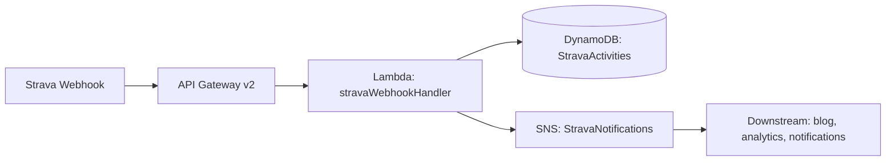

# 🏃 training-data-platform

A serverless data platform for ingesting, storing, and processing workout data from Strava and other fitness services. Managed with Terraform on AWS.

## Architecture

   



## What It Does

1. **Receives Strava webhooks** – API Gateway v2 (HTTP) accepts activity create/update/delete callbacks
2. **Stores workout data** – DynamoDB table `StravaActivities` stores each activity as a separate record
3. **Publishes events to SNS** – after saving an activity, it pushes an event to the `StravaNotifications` topic
4. **Enables downstream processing** – SNS can fan out to blog generators, analytics pipelines, Telegram bots, etc.

## AWS Resources

| Type | Name | Description |
|---|---|---|
| **DynamoDB** | `StravaActivities` | `PAY_PER_REQUEST` billing, `pk` + `sk` composite key |
| **SNS** | `StravaNotifications` | Topic for publishing activity events |
| **API Gateway v2** | `stravaWebhookHandler-API` | HTTP API, receives Strava callbacks |
| **Lambda** | `stravaWebhookHandler` | Python 3.14, webhook handler |
| **IAM Role** | `lambda_exec` | Least privilege – DynamoDB + SNS + CloudWatch only |

### IAM – Least Privilege

✅ We **do not** use `AmazonSNSFullAccess` or `AmazonDynamoDBFullAccess`.

Instead – a tight inline policy scoped to specific resources:

```hcl
# DynamoDB – operations on a single table
dynamodb:PutItem, GetItem, Query, UpdateItem → arn:aws:dynamodb:*:*:table/StravaActivities

# SNS – publish to a single topic
sns:Publish → arn:aws:sns:*:*:StravaNotifications

# CloudWatch – standard Lambda execution role for logs
AWSLambdaBasicExecutionRole
```

## Project Structure

```
.
├── main.tf              # AWS provider, S3 backend, module calls
├── locals.tf            # Local variables (account suffix, etc.)
├── variables.tf         # Input variables (region)
├── outputs.tf           # Outputs: API endpoint, DynamoDB table, SNS ARN
├── README.md            # This file
├── .gitignore           # Ignores *.tfstate, .terraform/, .env
│
└── modules/
    └── strava-webhook/      # Module: entire Strava ingestion infrastructure
        ├── main.tf          # DynamoDB, SNS, API Gateway, Lambda, IAM
        ├── outputs.tf       # api_endpoint, dynamodb_table_name, sns_topic_arn
        └── src/
            └── lambda_function.zip  # Python handler code
```

## Prerequisites

- [Terraform](https://developer.hashicorp.com/terraform/downloads) ≥ 1.x
- [AWS CLI](https://aws.amazon.com/cli/) configured with the `Weirdo` profile
- AWS account with IAM permissions to manage resources

## Quick Start

```bash
# 1. Clone the repository
git clone git@github.com:AdrianRoszak/training-data-platform.git
cd training-data-platform

# 2. Initialize – downloads providers
terraform init

# 3. Preview changes
terraform plan

# 4. Deploy
terraform apply
```

> **Note:** This project uses an S3 backend for state storage. If you don't have access to the bucket, comment out the `backend "s3"` block in `main.tf` and run `terraform init -reconfigure`.

## Outputs

| Name | Example Value |
|---|---|
| `api_endpoint` | `https://0q9xcv1r6b.execute-api.eu-central-1.amazonaws.com` |
| `dynamodb_table_name` | `StravaActivities` |
| `sns_topic_arn` | `arn:aws:sns:eu-central-1:REDACTED_ACCOUNT_ID:StravaNotifications` |

## Terraform State

State is stored **in S3** (not locally):

```
s3://terraform-state-weirdo-bucket-REDACTED_ACCOUNT_ID/terraform.tfstate
```

State locking is enabled (`use_lockfile = true`), preventing concurrent modifications.

## Security

- ✅ No API tokens or passwords are stored in code
- ✅ Terraform state is never committed (`.gitignore` + S3 backend)
- ✅ IAM follows **least privilege** – every policy is scoped to specific resources
- ✅ The AWS account ID in code is an identifier, **not** an access key – it is public in ARNs

## Roadmap (Monorepo)

The project will grow with additional services in a microservices architecture. Each with its own Terraform state:

```
training-data-platform/
├── ingestion/          ← current code (Strava webhook ingestion)
│   └── terraform.tfstate    (S3 key: ingestion/terraform.tfstate)
│
├── blog/               ← future: S3 + CloudFront + static site generator
│   └── terraform.tfstate    (S3 key: blog/terraform.tfstate)
│
├── analytics/          ← future: Athena + QuickSight dashboards
│   └── terraform.tfstate    (S3 key: analytics/terraform.tfstate)
│
└── modules/            ← shared Terraform modules
    └── strava-webhook/
```

Each service has an **independent state** and can be deployed separately without affecting others.

## License

MIT – do whatever you want. This is an educational project for learning Terraform and AWS.