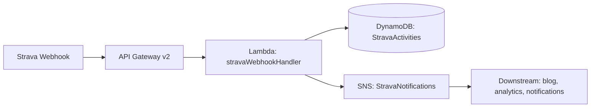

# 🏃 WorkoutDataHub

A serverless data platform for ingesting, storing, and processing workout data from Strava and other fitness services. Managed with Terraform on AWS.

## Architecture

   



## What It Does

1. **Receives Strava webhooks** – API Gateway v2 (HTTP) accepts activity create/update/delete callbacks
2. **Fetches full activity details** – Lambda enriches the webhook payload by calling the Strava API directly, obtaining complete workout data (distance, heart rate, elevation, splits, map, etc.)
3. **Stores workout data** – every activity lands in DynamoDB as a separate record, keyed by athlete and activity ID
4. **Publishes events** – after saving, a notification is pushed to an SNS topic for downstream consumers
5. **Manages OAuth automatically** – refresh tokens are rotated on every use and persisted in AWS Secrets Manager

### Current stack

| Layer | Service | Purpose |
|---|---|---|
| Ingress | API Gateway v2 (HTTP) | Receives Strava webhook callbacks |
| Compute | AWS Lambda (Python 3.14) | Validates, enriches, stores, and broadcasts activity events |
| Storage | DynamoDB | Activity records (composite key: athlete + activity) |
| Messaging | SNS | Fan-out to downstream services (email, analytics, blog) |
| Secrets | Secrets Manager | OAuth credentials with automatic refresh token rotation |
| State | S3 Backend | Terraform state with locking enabled |
| Identity | IAM (least privilege) | Scoped policies per resource, per action |

## Project Structure

```
.
├── main.tf              # AWS provider, S3 backend, module calls
├── locals.tf            # Local variables
├── variables.tf         # Input variables (region, Strava credentials)
├── outputs.tf           # Outputs: API endpoint, DynamoDB table, SNS ARN
├── README.md            # This file
├── .gitignore
│
└── modules/
    └── strava-webhook/      # Strava ingestion infrastructure
        ├── main.tf          # DynamoDB, SNS, API Gateway, Lambda, IAM, Secrets Manager
        ├── variables.tf
        ├── outputs.tf
        └── src/
            └── lambda_function.zip
```

## Prerequisites

- [Terraform](https://developer.hashicorp.com/terraform/downloads) ≥ 1.x
- [AWS CLI](https://aws.amazon.com/cli/) configured with the `Weirdo` profile
- AWS account with IAM permissions to manage the resources listed above

## Quick Start

```bash
git clone git@github.com:AdrianRoszak/workout-data-hub.git
cd workout-data-hub

terraform init
terraform plan
terraform apply
```

> **Note:** This project uses an S3 backend for state storage. If you don't have access to the bucket, comment out the `backend "s3"` block in `main.tf` and run `terraform init -reconfigure`.

## Outputs

| Name | Example Value |
|---|---|
| `api_endpoint` | `https://0q9xcv1r6b.execute-api.eu-central-1.amazonaws.com` |
| `dynamodb_table_name` | `StravaActivities` |
| `sns_topic_arn` | `arn:aws:sns:eu-central-1:REDACTED_ACCOUNT_ID:StravaNotifications` |

## Terraform State

State is stored in S3 (not locally):

```
s3://terraform-state-weirdo-bucket-REDACTED_ACCOUNT_ID/terraform.tfstate
```

Locking is enabled via `use_lockfile`, preventing concurrent modifications.

## Security highlights

- No API tokens or passwords in source code – everything lives in Terraform variables (marked `sensitive`) and Secrets Manager at runtime
- Terraform state is never committed (`.gitignore` + S3 backend)
- IAM follows **least privilege** – each policy is scoped to the exact resources and actions the Lambda needs

## Roadmap

The project grows in layers. Each new capability becomes a separate module with its own Terraform state – deployable independently, no blast radius across services.

### 🥇 Tier 1 – Complete the current module

- **SNS subscriptions** – wire up an actual consumer (email, Telegram bot, or a downstream Lambda)
- **Handle `update` and `delete` webhooks** – currently only `create` events are processed
- **Dead Letter Queue** – capture failed Lambda invocations for later inspection

### 🥈 Tier 2 – Observability & delivery

- **CloudWatch dashboard** – invocations, errors, duration, throttles
- **CloudWatch alarms** – alert on Lambda errors, API Gateway 5xx, DynamoDB throttling
- **GitHub Actions CI/CD** – `terraform plan` on PR, `terraform apply` on merge to main
- **Terraform workspaces** – separate `dev` and `prod` environments

### 🥉 Tier 3 – New data modules

- **Analytics module** – DynamoDB Streams → S3 (Parquet) → Glue → Athena → Grafana dashboards
- **Workout blog module** – auto-generate blog posts from activities, host on S3 + CloudFront
- **Multi-platform support** – normalise data from Garmin, Fitbit, and Apple Health into a common schema

### 🏆 Tier 4 – Full platform

- **REST API + frontend** – custom workout dashboard (React/Next.js on S3 + CloudFront, Cognito auth)
- **EventBridge bus** – replace direct SNS coupling with a custom event bus for looser module integration
- **Cost optimisation** – right-size Lambda memory, evaluate DynamoDB Provisioned + Auto Scaling for higher traffic

### Target monorepo layout

```
workout-data-hub/
├── .github/workflows/           # CI/CD pipelines
│
├── ingestion/                   # Current code (Strava webhook)
│   └── terraform.tfstate
│
├── analytics/                   # Data lake + dashboards
│   └── terraform.tfstate
│
├── blog/                        # Auto-generated workout blog
│   └── terraform.tfstate
│
├── api/                         # Backend for the frontend app
│   └── terraform.tfstate
│
├── frontend/                    # React/Next.js SPA
│   └── terraform.tfstate
│
└── modules/                     # Shared Terraform modules
    ├── strava-webhook/          ← implemented
    ├── garmin-webhook/          ← planned
    ├── fitbit-webhook/          ← planned
    └── event-bus/               ← planned
```

## License

MIT – do whatever you want. This is an educational project for learning Terraform and AWS.